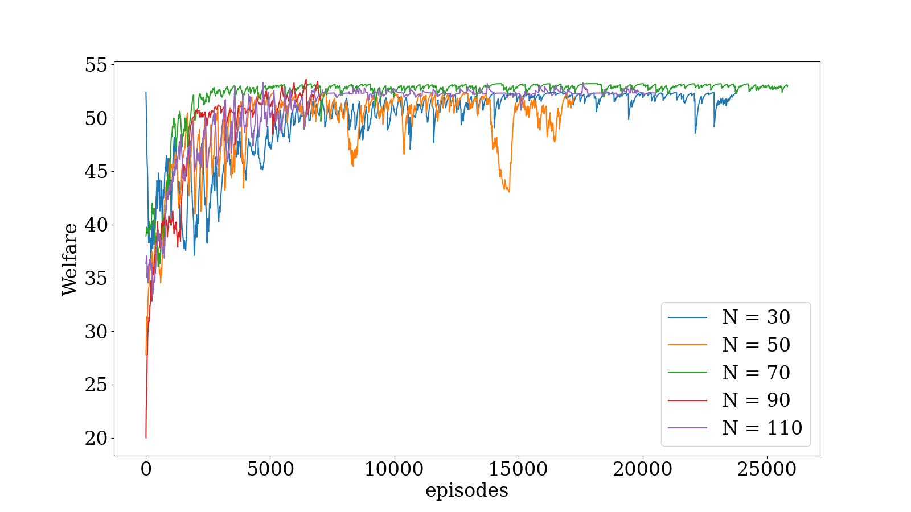
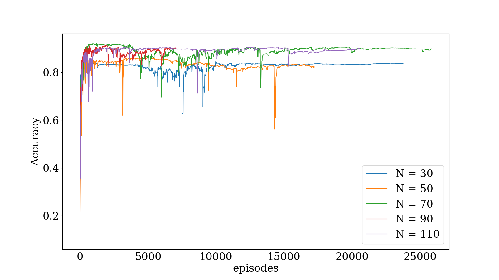

# Toward an Automated Auction Framework for Wireless Federated Learning Services MarkeT

This repository implements the DRLA in "Toward an Automated Auction Framework for Wireless Federated Learning Services Market".


## Install guidelines

Pull the docker images zhyliu00/dgl_docker:0.05 and run a new container.

```bash
sudo docker pull zhyliu00/dgl_docker:0.05
sudo docker run -itd --name DRLA -v PATH_TO_CODE:/code zhyliu00/dgl_docker:0.05 bash
sudo docker exec -it -u root DRLA bash
cd /code
bash train_DRLA.sh
```

## Directory

The Root is described as below

```
ROOT
+-- outputs
|   +-- 20220411-024816
|   +-- 20220411-064519
|   +-- ...
+-- result
|   +-- ...
+-- result
+-- readme.md
+-- train_DRLA.py
+-- train_DRLA.sh
+-- env.py
+-- model.py
+-- plot.py
```

- `outputs` contains the training log and model file. Each time run `train_DRLA.py` to launch a new training process, it will automatically create a folder to store the training log and model file.
- `result` is for plot. After training, it is required to manually move the move the `result.json` file in each training folder here to plot the result.
- `train_DRLA.py` train python script.
- `train_DRLA.sh` train shell script for conveniently tuning the hyper-parameter.
- `env.py` contains the gym-like enviroment for RL setting. Both FL platform and worker are implemented. The co-training process for MNIST classification will be automatically done.
- `model.py` contains the GCN module and DQN agent.

## Hyperparameter
Here we select some important hyperparameters that are related to DRLA
```python
parser.add_argument('--g_hidden',type=int,default=64) # The hidden size of GCN
parser.add_argument('--J',type=int,default=8) # The hyperparameter in Q function
parser.add_argument('--K',type=int,default=8) # The hyperparameter in Q function
parser.add_argument('--N',type=int,default=100) # Total number of devices
parser.add_argument('--layers',type=int,default=2) # The number of layers of GCN
parser.add_argument('--delta_g',type=int,default=10) # Global epoch
parser.add_argument('--delta_l',type=int,default=5) # Local epoch
parser.add_argument('--total_episode',type=int,default=50000) # Maximum episode of env (i.e. finish the worker selection)
```

## Result

The result (Social Welfare and MNIST accuracy) of training in the setting N = [30 50 70 90 110] are ploted




Some of the training log is as follow. It print out the welfare and the selected worker in each episode.

```
[tensor([23.2885]), tensor([-1.5261])]
finish. welfare : tensor([43.2885]), acc : 0.8277999758720398, workerList : tensor([[49]], device='cuda:0')
------------
init_states shpe : torch.Size([50, 134])
this episode, accuracy is 0.828000009059906
[tensor([23.2885]), tensor([2.4070]), tensor([1.9007]), tensor([-0.3565])]
finish. welfare : tensor([47.5961]), acc : 0.828000009059906, workerList : tensor([[16],
        [36],
        [49]], device='cuda:0')
------------
init_states shpe : torch.Size([50, 134])
this episode, accuracy is 0.8278999924659729
[tensor([23.2885]), tensor([2.3108]), tensor([-0.6478])]
finish. welfare : tensor([45.5993]), acc : 0.8278999924659729, workerList : tensor([[36],
        [49]], device='cuda:0')
------------
init_states shpe : torch.Size([50, 134])
this episode, accuracy is 0.8277000188827515
[tensor([23.2885]), tensor([-1.5261])]
finish. welfare : tensor([43.2885]), acc : 0.8277000188827515, workerList : tensor([[49]], device='cuda:0')
------------
init_states shpe : torch.Size([50, 134])
this episode, accuracy is 0.8276000022888184
[tensor([23.2885]), tensor([-1.5261])]
finish. welfare : tensor([43.2885]), acc : 0.8276000022888184, workerList : tensor([[49]], device='cuda:0')
------------
init_states shpe : torch.Size([50, 134])
this episode, accuracy is 0.8264999985694885
[tensor([7.1166]), tensor([10.7134]), tensor([1.8968]), tensor([3.5350]), tensor([2.5554]), tensor([1.0094]), tensor([0.6667]), tensor([0.8353]), tensor([0.7392]), tensor([0.6661]), tensor([-1.3469])]
finish. welfare : tensor([49.7340]), acc : 0.8264999985694885, workerList : tensor([[ 1],
        [ 3],
        [ 6],
        [16],
        [36],
        [42],
        [43],
        [45],
        [47],
        [49]], device='cuda:0')
------------
init_states shpe : torch.Size([50, 134])
this episode, accuracy is 0.8269000053405762
[tensor([23.2885]), tensor([-1.5261])]
finish. welfare : tensor([43.2885]), acc : 0.8269000053405762, workerList : tensor([[49]], device='cuda:0')
------------
init_states shpe : torch.Size([50, 134])
this episode, accuracy is 0.8274000287055969
[tensor([23.2885]), tensor([-1.5261])]
finish. welfare : tensor([43.2885]), acc : 0.8274000287055969, workerList : tensor([[49]], device='cuda:0')
------------
init_states shpe : torch.Size([50, 134])
this episode, accuracy is 0.8274000287055969
[tensor([23.2885]), tensor([-1.5261])]
finish. welfare : tensor([43.2885]), acc : 0.8274000287055969, workerList : tensor([[49]], device='cuda:0')
------------
init_states shpe : torch.Size([50, 134])
this episode, accuracy is 0.8271999955177307
[tensor([14.9928]), tensor([6.5119]), tensor([3.4469]), tensor([2.2881]), tensor([0.3429]), tensor([0.7330]), tensor([0.7200]), tensor([0.6677]), tensor([0.6181]), tensor([0.3436]), tensor([0.5480]), tensor([0.5123]), tensor([0.3198]), tensor([0.1862]), tensor([0.2779]), tensor([-0.3122])]
finish. welfare : tensor([52.5093]), acc : 0.8271999955177307, workerList : tensor([[ 1],
        [ 2],
        [ 3],
        [ 5],
        [ 6],
        [15],
        [16],
        [21],
        [27],
        [36],
        [38],
        [42],
        [43],
        [45],
        [49]], device='cuda:0')

```